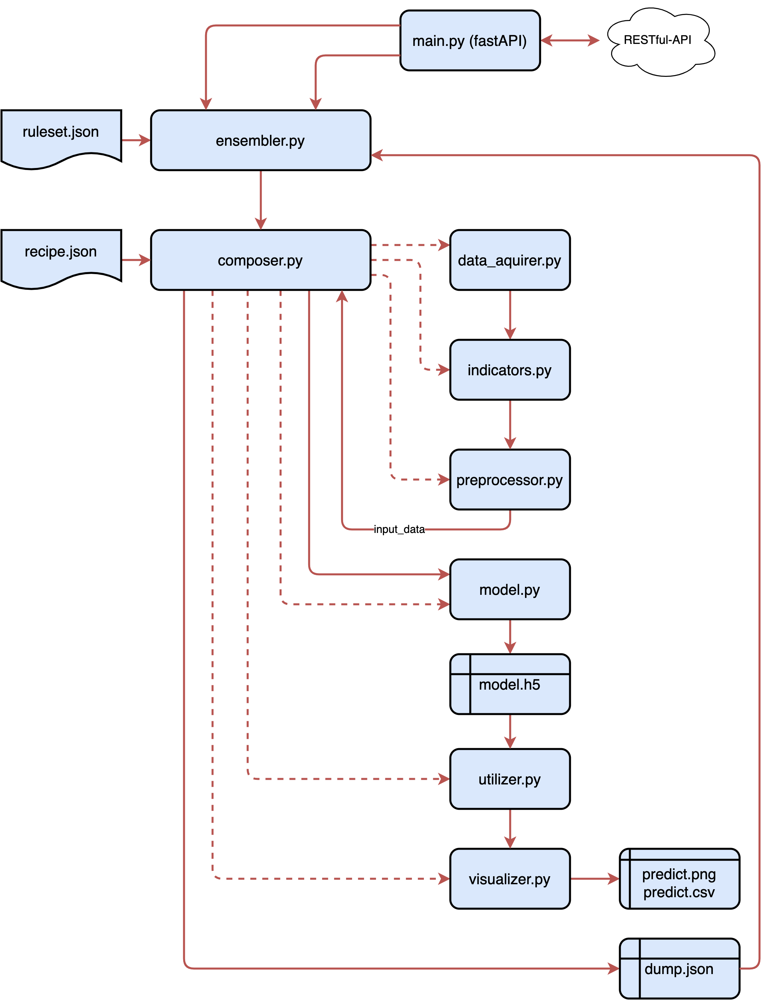

# Forex-Predicter

- This Project aims to develop some tools to predict n- steps ahead in the Foreign Exchange Market.
- The technics and approaches used in this project can be applied to other fields of time series prediction as well.

## Description



- The application does basically the following tasks:
  - Data acquisition
  - Application of indicators
  - Data preparation for machine learning model
  - Training of the model
  - Utilization of the model for prediction
  - Visualization of the results
  - Interpretation of the results, to eventually make market decisions
  - Notification of the user, if a certain condition is met

## Getting Started

```bash
git clone <url_of_this_project>
cd Forex-Predicter
```

Create a virtual environment and install the requirements.

````bash
virtualenv venv
source venv/bin/activate
````

If you want to use the GPU version of Tensorflow, you have to install the requirements with the following command:

```bash
pip install -r requirements_gpu.txt
```

Otherwise, you can use the CPU version:

```bash
pip install -r requirements.txt
```

## How to use the Application

For now, this project is still in the testing phase and not ready for production. However, you can use the application by running the test step by step or conduct a system test. Please refer to the next section for more information.

## Test Applications

### Run single Tests

There are multiple test cases for every module in the application flow.
You can find them in the folder `test`. Some tests require data from previous tests. Therefore, you have to run the tests in the following order:

```bash
python test/data_aquirer_test.py
python test/indicator_test.py
python test/preprocessor_test.py
python test/model_test.py
```

### Run System Test

There is a system test, which iterates over a bunch of given currencies and
has the aim to check the performance of the model on the test data of
the given currencies. The system test is located in the folder `test` and
can be executed by running the following command:

```bash
python test/system_test.py
```

### Run Utilizer Test

Finally, there is a utilizer test, to use the model to predict the next n steps. 🥳
After running the system test, you can run the utilizer test by executing the following command:

```bash
python test/utilizer_test.py
```

I suggest, using the prediction model only in those cases, where the system test shows a promising result.

### Results of the System Test

The results for some currencies can be found in the folder `system_test`. Some examples are listed below. Keep in mind, that those test results may change
for every train iteration and are not guaranteed to be the same for every run.
To gain some good results for future prediction, choose those models which
show a good performance on the test data. It may be a good approach to save
those models, which show a good performance on the test data and always use
them for future predictions in the utilizer test for a certain amount of time.

- AUD/CHF
  
- AUD/USD
  
- EUR/CHF
  
- EUR/JPY
  
- GBP/CHF
  

## Roadmap

### Done

- [x] Implement data_aquirer.py
- [x] Implement indicator.py
- [x] Implement preprocessor.py
- [x] Implement model.py  
- [x] Implement visualizer.py

### To Do

- [ ] Tune the hyperparameters
- [ ] Test branched_model.py
- [ ] Implement composer.py
- [ ] Implement utilizer.py
- [ ] Implement interpreter.py

### Ideas for the Future

- [ ] Filter the data concerning some anomalies.
- [ ] Implement some reinforcement learning algorithms for automatic trading (very advanced).


